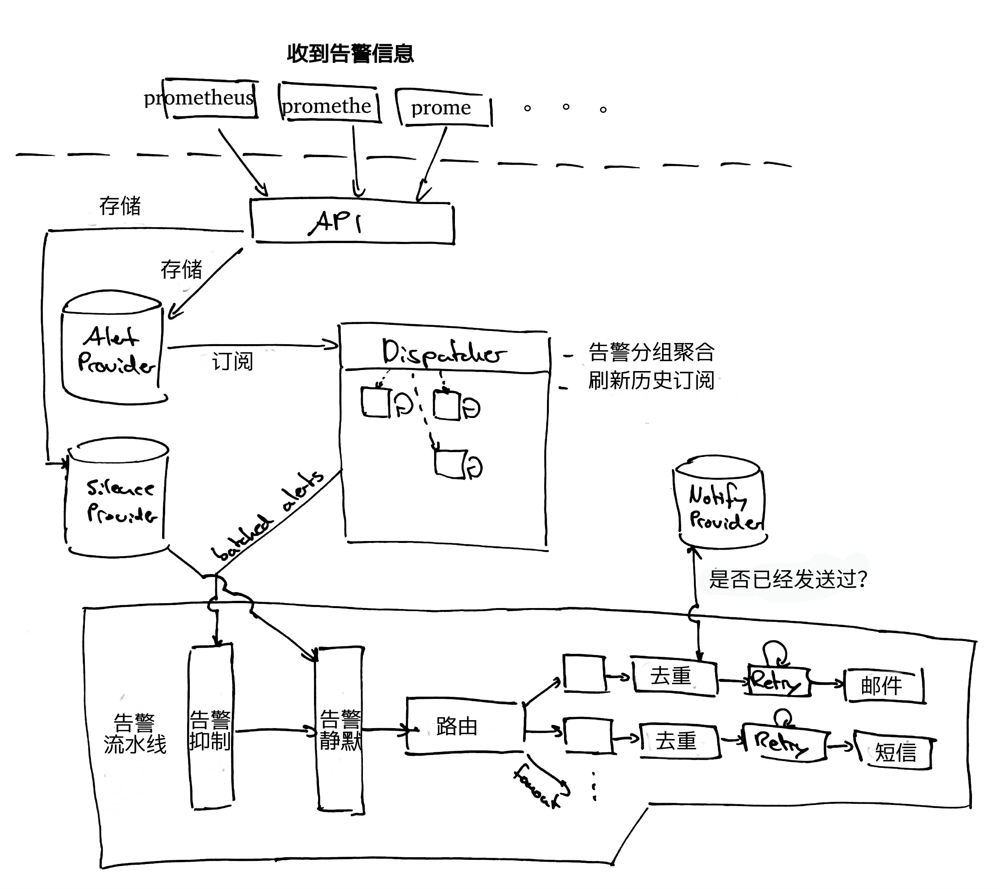

# alertmanager review

1. 手动静默告警
2. 基于依赖关系的告警抑制
3. 通过告警标签的告警聚合
4. 处理告警重复通知
5. 通过外部服务发送警报通知

## alertmanager的架构

订阅： 会返回当前正在发生的告警
Dispatcher 调度员：
    1. 根据labels 来分组聚合
    2. 分捡发送到正确的接收者

Dedup 去重

## 内部术语

### 分组
分组是指将同一类型的警报分类为单个通知。

### 抑制(Inhibition)
抑制是指当警报发出后，停止重复发送由此警报引发其他错误的警报的机制。
比如：
如果发现交换机故障告警，这台交换机下的所有服务器就将不告警

### 沉默(Silences)
手动设置规则，匹配到将不告警（比如：服务割接时）

### 接收器(receiver)
顾名思义，警报接收者的配置。（发给谁，怎么发）

1. 内部支持的接收者 
需要修给代码,自己实现个Notify方法即可。 (必须会go)

2. webhook
什么语言都可以。

## simple.yml 文件简单介绍
group_wait,group_interval,repeat_interval,ResolveTimeout 的区别

  group_wait: 30s
  #每次等待30s 对当前告警进行分组合并

  group_interval: 5m
  #一个分组的告警，如果已经发出，同一个组，必须等待5m 后才会再次发出

  repeat_interval: 3h 
  #如果一个告警被发送，等待3h再次发送同一个告警

  ResolveTimeout:10h   
  #如果一个告警，5h还没收到再次告警，就自动确认恢复

举例：
单个警报规则（在prometheus中）以标签集{foo =“bar”，instance =“instanceA”}触发。 
Alertmanager发送警报，并添加到新的警报组。
然后，使用不同的标签集{foo =“bar”，instance =“instanceB”}再次触发相同的警报规则。 
这也被添加到同一个警报组。 （group_by: ['foo', 'instance']）
Alertmanager不会再发送一个额外的警报，直到在group_interval之后。

如果5分后B再发出，再次有同样的B告警，需要等待3h后再次发出

## web页面
prometheus:
http://z.sh.rhel.cc:9090/graph

alertmanager:
http://z.sh.rhel.cc:9093/#/alerts

这里演示创建个Silence

## amtool 简单使用
./amtool alert

./amtool -o extended alert
./amtool silence query
## 黑科技--把静态文件 存储到二进制
go-bindata -o myfile.go data/

## 
Dispatcher 中分组的实现：
1. 循环从alert provider 获取数据 调用processAlert(alert, r) 方法，进行数据分组聚合

func (d *Dispatcher) processAlert(alert *types.Alert, route *Route) {
。。。。。。
	// 如果分组不存在就创建它，如果存在就insert已有分组
	ag, ok := groups[fp]
	if !ok {
		ag = newAggrGroup(d.ctx, group, &route.RouteOpts)
		groups[fp] = ag

		go ag.run(func(ctx context.Context, alerts ...*types.Alert) bool {
			err := d.notifier.Notify(ctx, alerts...)
			if err != nil {
				log.Errorf("Notify for %d alerts failed: %s", len(alerts), err)
			}
			return err == nil
		})
	}

	ag.insert(alert)
}

怎么分组的：
// newAggrGroup 返回 一个新的聚合组.
func newAggrGroup(ctx context.Context, labels model.LabelSet, opts *RouteOpts) *aggrGroup {
	ag := &aggrGroup{
		labels: labels,
		opts:   opts,
		alerts: map[model.Fingerprint]*types.Alert{},
	}
	ag.ctx, ag.cancel = context.WithCancel(ctx)

	ag.log = log.With("aggrGroup", ag)

	//在生成第一批通知之前先设置下一次等待时间。
	ag.next = time.NewTimer(ag.opts.GroupWait)    //30s

	return ag
}

## 吐槽时间

alertmananger比我想象的要复杂

原本以为是一个简单的告警管理 结果越看越心慌

我从它的第一个版本0.0.1 看到 0.0.4的时候,作者完全代码重构 直接发布0.1版本

0.1版本 把收到的告警信息存放到本地的sqlite数据库
0.2版本 抛弃了sqlite把告警存放到了 BoltDB
0.3版本 发现使用数据库没啥意义 直接存内存
0.4版本 修修补补
0.5版本 发现要实现多台alertmanager数据互通，并且告警平台集群化，
       作者引入了github.com/weaveworks/mesh这个分布式集群通信的第三方库，
       就像etcd引入raft协议库，它引入的是gossip协议库，数据节点就互通，定期把内存数据快照的本地

0.6 - 0.8版本 对上面的修修补补

这不是个简单的告警管理，是个分布式的告警平台，就像etcd有个etcdctl查看内部数据，集群节点信息一样，
alertmanager有个叫amtool的客户端。

  