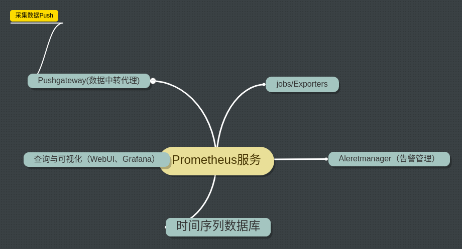
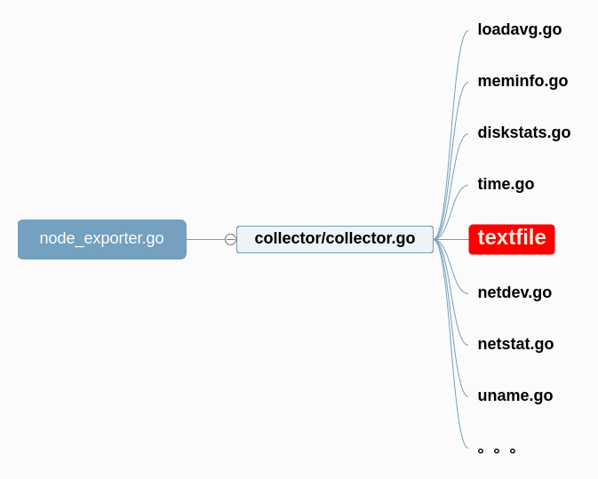

#node_exporter_review

## prometheus的主要组件  

***node_exporter  push_gateway   prometheus   alertmanager grafana***

数据生产者： node_exporter  push_gateway

数据储存： prometheus

数据消费： alertmanager grafana


主题思想思想是 获取数据并暴露数据   prometheus定时去pull  grafna读取数据库，并绘图



## 展示apigw的grafana图形
grafna地址：
http://172.16.18.5:30083/

prometheus地址：
http://172.16.18.5:30082/


测试：
访问地址：
http://172.16.18.5:31600/epg_server/mango_tv


测试：
cd ~/go/src/apigw_exporter

./apigw_exporter -redis-address=172.16.18.30:30447

## 我是怎么实现的
1. prometheus的数据结构

Counter(计数器)  ---> uptime等，只增不减

Gauge(仪表盘)    --> 当前负载等，有增有减

Histogram(柱状图) --> 时间段

Summary(概要) --> 分布情况


Untyped  --> 无类型

1. apigw_exporter 获取redis的信息
2. apigw_exporter 暴露出去
3. server 获取apigw_exporter中的数据
4. grafana展示


遇到的问题： 每秒同类型多个数据


## node_expoter 是怎么实现的

中有三个关键文件，node_exporter.go , collector/collector.go , loadavg.go等




1. 自己写代码

比如，我们如何获取主机的做了几个bonding，有哪些网卡，每块网卡的状态

1. cat /sys/class/net/bonding_masters
bond0 bond2

2. cat /sys/class/net/bond0/bonding/slaves
eth0 eth1

3. cat /sys/class/net/bond0/slave_eth0/operstate 
up

这样就获取到了，这台主机有哪些 bond和各自的状态

1. 绑定prometheus数据结构
2. update数据


每个ch （channel），
// 收集到的数据
Update(ch chan<- prometheus.Metric) error  传入prometheus.Metric的数据，最终发也是返回ch <- prometheus.MustNewConstMetric(）


2. textfile模块

--collector.textfile.directory

写脚本，crontab定时生成如下文件 xxx.prom 
``` bash
# HELP testmetric1_1 Metric read from monkey1
# TYPE testmetric1_1 gauge
testmetric1_1{foo="bar"} 110

# HELP testmetric1_2 Metric read from monkey2
testmetric1_2{foo="baz"} 210
```